

 
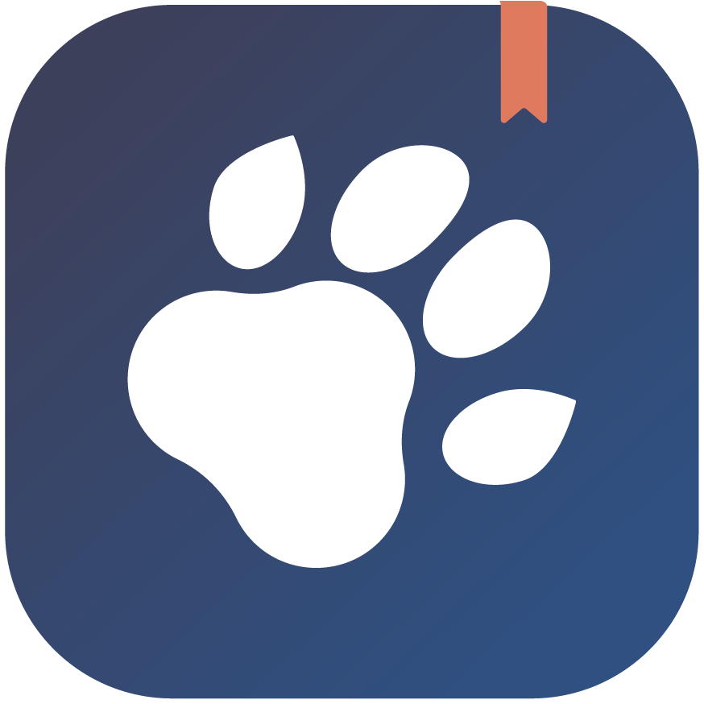
  
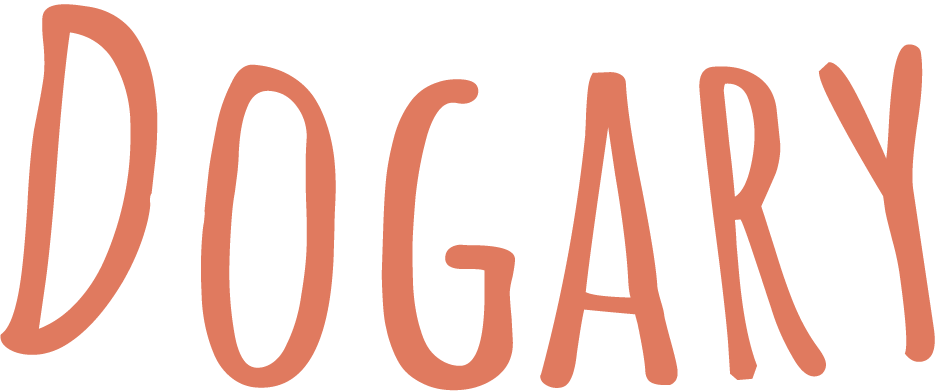

# Project Overview - Dogary🐶

As my capstone-project of the neue fische Bootcamp I am developing the React App [Dogary](https://dogary.vercel.app/). The dog's daily needs can be tracked in the App, which simplifies communication between dog owners. In addition, appointments can be organized in a calendar and todos can be planned.

## Used technology

## Features

The app is split across three pages which each hold different functionalities.

### Tracking

The key element of the Dogary-App is it's tracking feature. Here the user can track the food the dog ate while simultaneously setting a food-goal for the dog to reach that day day. The same applies to the walks the did with the dog and the business the dog did. The user can also display a history and get a quick overview of the activities of the last few days.

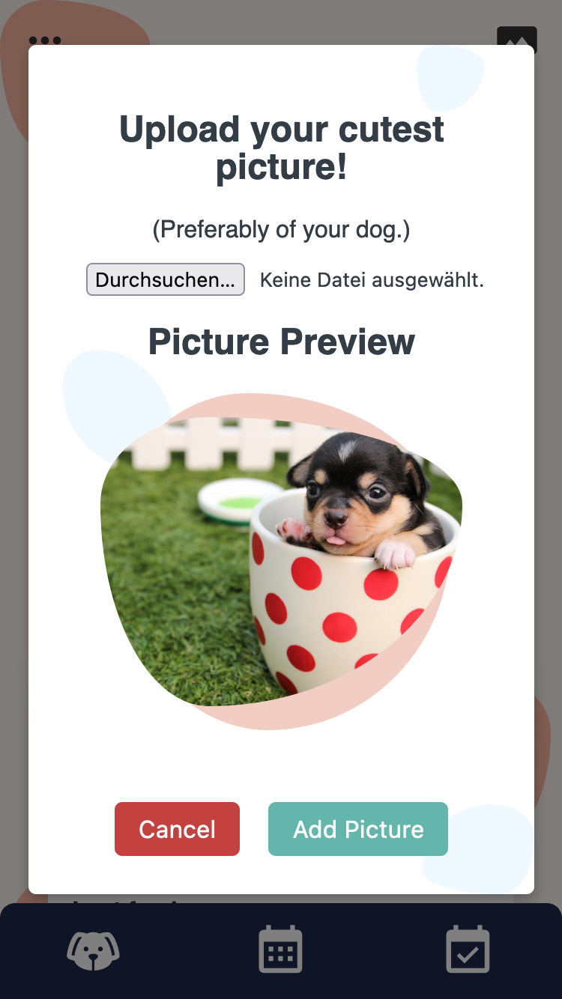
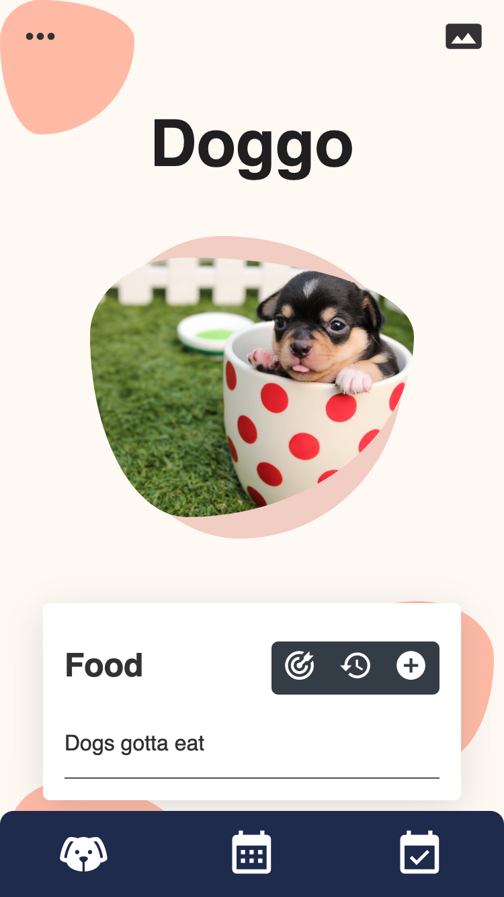
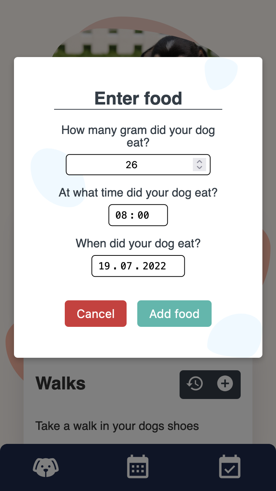
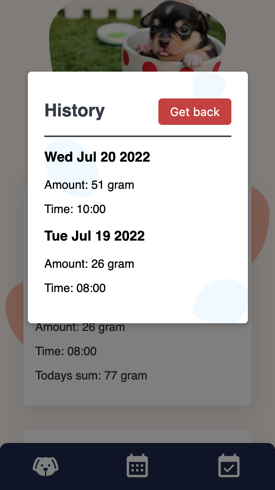

You can also upload a cute picture of your dog to display on the main screen!

### Calendar

Thanks to the Full Calendar for React-Library I was able to implement a Calendar into the dogary-App. This allows the user to add their dog-related events and change their date using drag-and-drop.

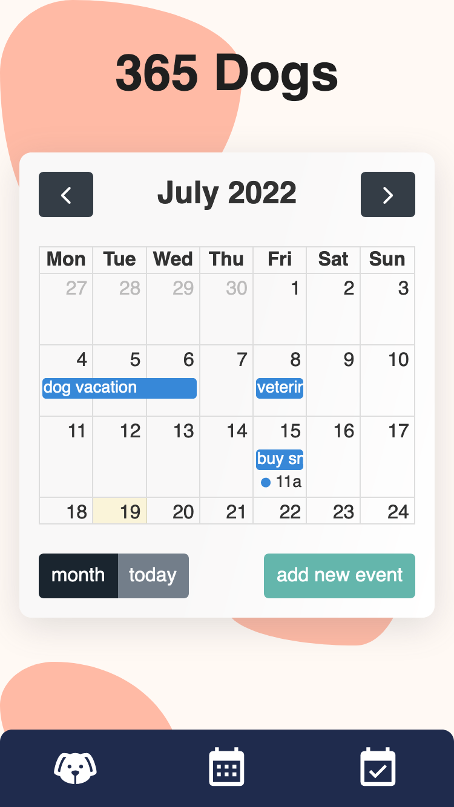
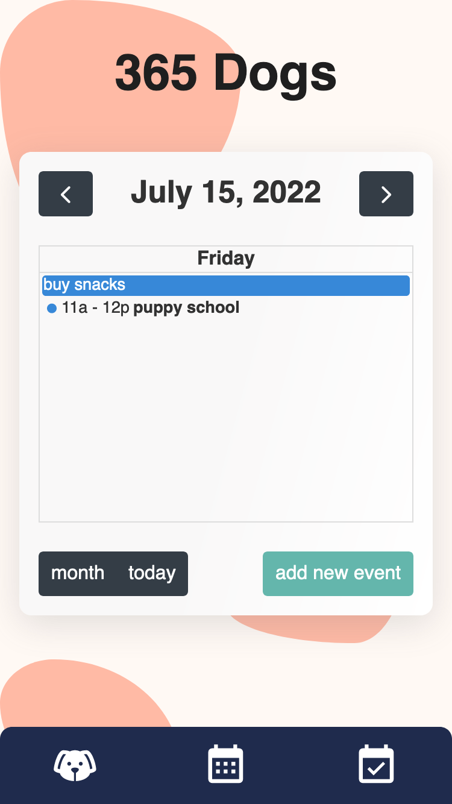

### ToDo

The final aspect of the dogary-App is the todo-list feature. Here the user can organize, edit, delete or set todos to urgent if they are extremely important.

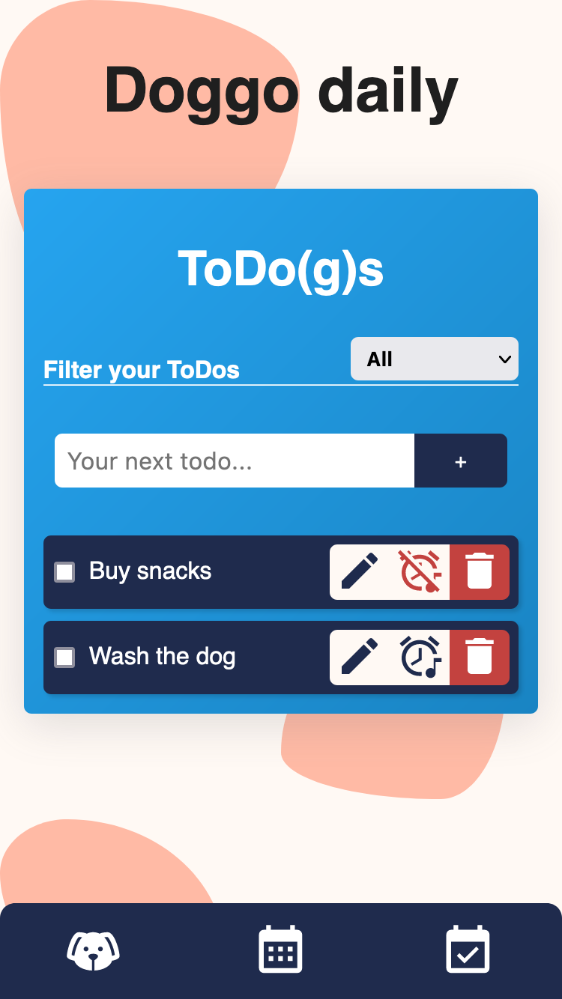

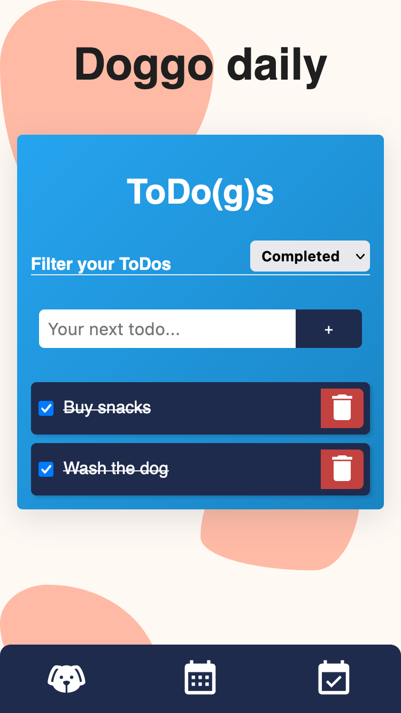

## Plans for the future🌱

### Statistics

In the future I would like to build a page for statistics. On this page, the user should see the entered activities of the dog graphically processed. I would also like to add the ability to track the dog's weight.

### Diary

What is a dog without the experiences with him? In order to remember them, I would like to add another diary page in which the user can enter the special experiences with his dog and have them to go back again and again.

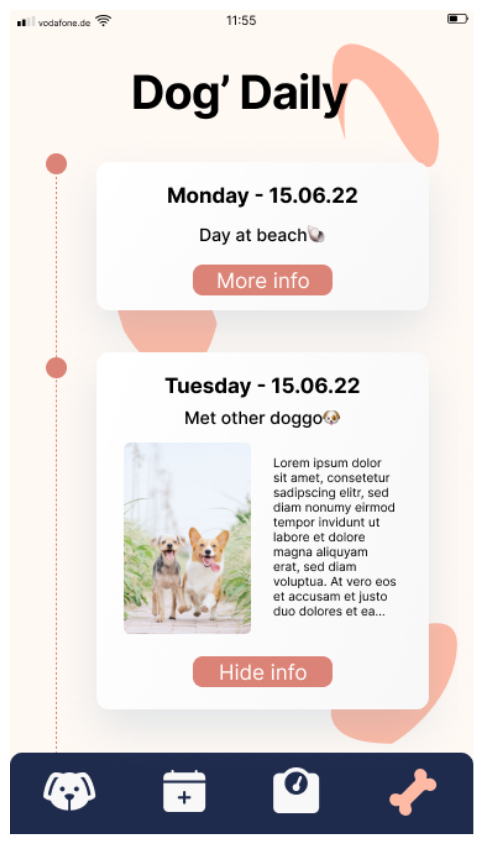

